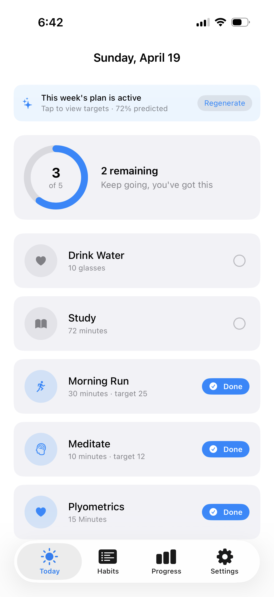
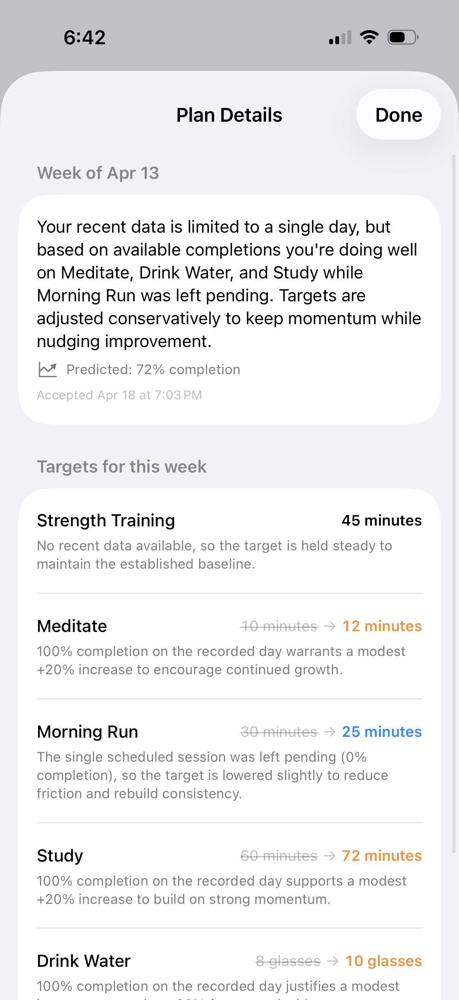
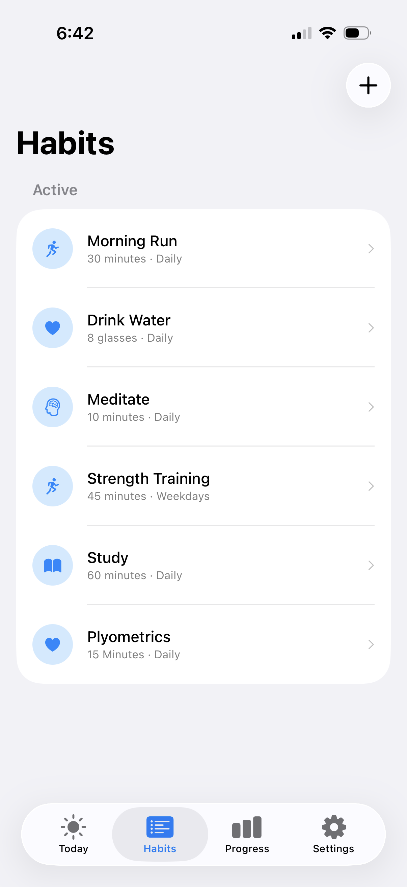
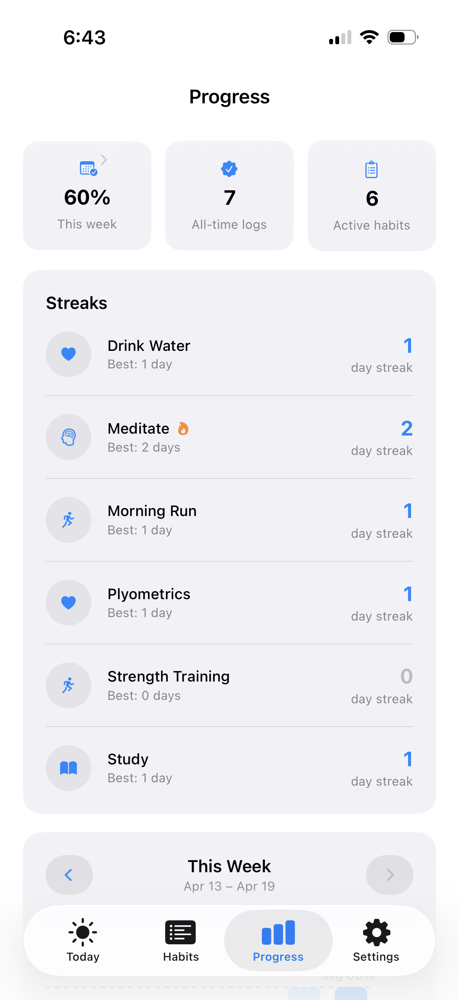

# AdaptiveDailyOS

An iOS habit tracker that treats consistency as a gradient, not a checkbox.
Log partial completions, and an AI coach adapts your targets week‑to‑week —
easing off when you're struggling, raising the bar once you're hitting 100%.

Built with SwiftUI + SwiftData, targeting iOS 17+.

---

## Why another habit tracker?

Most habit apps give you one button: **done** or **not done**. A 30‑minute run
you cut short at 10 minutes counts the same as not running at all. Over time,
that binary pressure burns people out — the day you fall short, you skip
logging entirely, and the streak dies.

**AdaptiveDailyOS is different on two axes:**

### 1. Habits aren't binary

Log what you actually did. Planned 30 minutes of study, only managed 20? Log
the 20. The app stores the logged value alongside the target, and your
history reflects reality — not a sanitized version of it.

### 2. Targets adapt to you

At the start of each week, an AI coach looks at your recent completion data
and proposes new targets for the next seven days:

- **Hitting 100%?** The target nudges up (+20%) to keep you growing.
- **Struggling with a habit?** Target drops (‑20 to ‑40%) to rebuild momentum.
- **No recent data?** Target holds steady — no guessing.

Mid‑week, if a habit is getting consistently missed, the app proactively
offers a *smaller* target you can accept with one tap. The goal is to meet
you where you are, then progressively nudge you toward the version of
yourself you're trying to build.

---

## App flow

### Today — log habits, see today's plan

The home tab. Shows your daily progress ring, the active weekly plan
banner, and a card for each scheduled habit. Tap a habit to log a value
(full target, partial, skip, or custom amount).



### Plan Details — see what the AI adjusted and why

Tap the weekly plan banner to see the AI's reasoning for every target this
week. Previous target → new target, with a short rationale per habit.



### Habits — manage your library

Create, edit, or archive habit templates. Each habit has a category, target
value + unit, frequency (Daily / Weekdays / Weekends / Custom), and a
difficulty score that feeds the AI's adaptation logic.



### Progress — streaks, weekly chart, history

Three stat tiles, per‑habit streaks with personal bests, a tappable weekly
bar chart (with week navigation), and a full history calendar heatmap
reachable from the "This week" tile.



---

## Features

### Available now (Phase 1 + partial Phase 2)

**Core tracking**
- Today view with daily progress ring and per‑habit status chips
- Partial logging — log any value, not just "done" / "not done"
- Four statuses per day: pending, completed, skipped, missed
- Auto‑generated daily habits based on frequency (Daily / Weekdays / Weekends / Custom)
- Habit library with 7 categories: Health, Fitness, Mindfulness, Learning, Productivity, Social, Custom

**Weekly planning**
- Sunday‑night weekly plan generation powered by Anthropic's Claude
- Target adjustments with per‑habit rationale
- Plan preview + accept/regenerate before it takes effect
- Week‑over‑week predicted completion rate

**Mid‑week adaptation**
- Detects struggling habits (2+ misses in the last 3 scheduled days)
- Offers reduced targets with AI‑generated rationale
- One‑tap accept/reject per habit
- Throttled so the same habit isn't proposed repeatedly

**Progress & history**
- Per‑habit streaks with personal best
- Weekly completion bar chart with prev/next week navigation
- Full month calendar heatmap (tap any past day for details)
- Day detail sheet showing logged value vs. target
- All history persists locally — past weeks remain viewable

**Onboarding**
- Three‑screen welcome → habit picker → confirmation flow
- Seeds a starter set of habits you can edit or remove

**Settings**
- Anthropic API key storage via iOS Keychain
- Accent color picker
- Reset / sample data helpers

### In progress (Phase 2 continued)

- Adaptation history timeline on the Progress tab
- Local notifications for habit reminders and Sunday planning prompt
- macOS network entitlement for Mac Catalyst builds
- App icon (1024×1024)

### Not yet started (Phase 3+)

- iCloud sync
- Widgets (Today lock‑screen / home‑screen)
- Apple Watch complication
- Shortcuts / Siri integration
- Export to CSV

---

## Tech

- **UI:** SwiftUI (iOS 17+), Swift Charts
- **Persistence:** SwiftData (local, on‑device)
- **AI:** Anthropic Messages API (`claude-sonnet-4-6`), called directly — no backend
- **Testing:** Swift Testing for unit tests, XCTest for UI
- **No third‑party dependencies**

Architecture note: views query the model context directly via `@Query`
and `@Environment(\.modelContext)`. There is no ViewModel layer. AI calls
are isolated in `Services/AIService.swift` and `Services/AdaptationService.swift`.

---

## Getting started

```bash
# Build for iOS Simulator
xcodebuild build -scheme AdaptiveDailyOS -destination "platform=iOS Simulator,name=iPhone 16"

# Run tests
xcodebuild test -scheme AdaptiveDailyOS -destination "platform=iOS Simulator,name=iPhone 16"
```

To enable AI planning, paste an Anthropic API key into **Settings → API Key**
inside the app. The key is stored in the iOS Keychain and never leaves your device
except to call the Anthropic API.
